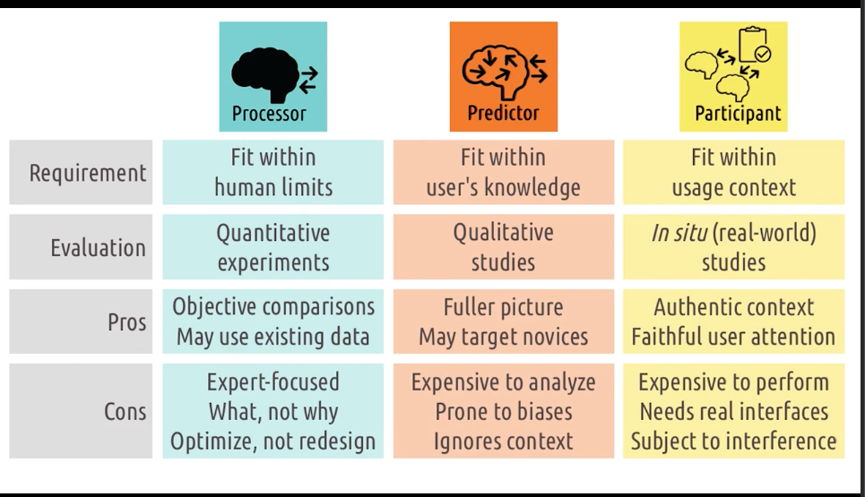

# HCI Section 2 Notes (Week 3)

## 2.1 Intro to Principles of Human-Centered Design

1. Focus on Users and Tasks - not interfaces
2. Role of interface as mediator
3. user roles
4. user experience at multiple levels

### Interfaces

User and task interact through the interface.
Need to understand user goals and the task! Must understand the task.
Focusing on the task allows us to come up with revolutionary designs.

### 5 Tips to identify task

1. watch real users - don't speculate
2. talk to real users! talk aloud?
3. start small - look at small interactions. don't come in thinking you already know.
4. abstract up - keep asking why and go up the chain
5. you aren't the user. even if you do the task, you are not the person you are designing for. leave
   behind your own experiences and preconceived notions

### Useful and Usability

The ultimate goal of HCI is to create interfaces that are both useful and usable.
Useful is just allowing the user to complete tasks.
Usability closes the gap/gulf between the user and the system, reduces cognitive load.

### Role of User

1. Processor - nothing more than sensory processor. take input in and spit out output.
    1. interface should fit within human limits - what they can sense and what they can do.
    2. usability here means that it should be physically usable. user can see colors, touch buttons,
       etc.
    3. evaluate interface with quantitative experiments - see how quickly
    4. **not helpful for hci**
2. Predictor - care deeply about human knowledge, expectations, experience, thought process. they
   can predict what will happen. map input to output. get into their head.
    1. interface should fit within human knowledge, leverage what humans know, and help them learn
       what they don't know
    2. evaluate using qualitative - ex situ studies - controlled environment - do task analysis or
       cognitive walkthrough to understand thoughts.
    3. advantages over just processor view, but still just focuses on one user and one task. narrow.
3. Participant - not just interested in what is going on inside head, but around them as well. what
   other tasks, interfaces, people they are interacting with. need to understand available cognitive
   resources, competing tasks, etc.
    1. interface must fit within context. not enough to be able to use and to know how to use, they
       need the interface to work within their context
    2. evaluate using in situ studies - within authentic context - vacuum is not enough.

Processor view goes back to the behaviorist view of psychology - systematic view of human behavior.
created by john b watson - "Little albert". pavlov is another example. 19th century. Observable
behaviors and outcomes, not underlying cognition. This is just looking at behaviors in design and
not caring about why.

Predictor view goes back to cognitive - perception, memory, creativity and other things going within
mind. Kant and Descartes worked on this. started picking up in the 1950s as foil to behaviorism.
cognitive science. care about what the user is thinking. what do they predict the outcome to be, the
right action to take? The user is the one doing the predicting. we need to understand how they
predict the interface will behave.

Participant view goes back to the functionalism/systems psychology - human behaviors within broader
systems, contexts. uniquely cares about user environment. user/interfaces are participants within
larger cognitive system.

### Using User models to evaluate interfaces

1. Processor Model - bring them in and time them, have them do tasks to gather quantitative data.
    - Pros:
        1. use existing data perhaps
        2. enables objective comparison - using the stats.
    - Cons:
        1. no reason for differentiation - can't think of why one interface is better than another
        2. can't differentiate by expertise
        3. helps optimize, not redesign
2. Predictor Model - ask the user questions, show them prototypes, do interviews. find info about
   why users prefer different interfaces at different times.
    - Pros:
        1. more complete picture of interaction, what they are thinking about, why they did
           something
        2. can target different levels of expertise - bring in experts vs offices
    - Cons:
        1. analysis can be expensive - not as easy as analysing numbers. a lot of attention is
           required.
        2. analysis is subject to biases. we need to fight biases.
        3. ignores the broader interaction context - not authentic environment (ex situ not in situ
           here).
3. Participant Model - view interface and user within the real context. look interface, user as
   participants in broader activity.
    - Pros:
        1. evaluate in authentic context.
        2. capture authentic level of user attention - captures distractions
    - Cons:
        1. expensive to conduct - have to set up the environment to be authentic.
        2. requires real, functional interfaces - prototype won't work. they have to be designed and
           created to work in real context.
        3. subject to uncontrollable variables - cannot control environment.

in short, we will use all of them at different times. use one and then another, informed by our
previous.

### UX

UX comes from interaction between users/tasks through interfaces. always some ux happening because
of this.

UX goes beyond simple interaction. emotional, personal, experimental relationship elements are
incorporated. need to expand scope of it.

individual - age, experience, age, expectations inform view of the user. does user feel the
interface was designed for them? are they joyous about the task?
group - different experiences bring about different experiences.
society - can bubble up to societal views.

---

## Normon - Cognitive Engineering CH 3

**Cognitive Engineering** attempts to apply cognitive science to computers. Understand principles
behind human action relevant for engineering design, and to devise systems that are pleasant to use.
_Pleasurable Engagement_ is the goal.

To make tasks successful, we want to make sure we have the correct conceptual

### Psychological/Physical Variables Variables

Good design, that is pleasing, requires us to make sure we are providing control over variables of
psychological interest!

#### Aspects of a task

1. Matching psychological variables of interest to the physical variables that are being controlled.
2. Mapping relationships between physical mechanisms and system state - interaction between two
   controls should be easy - we should be able to map b/w control and function, control and outcome
3. Feedback - feedback should be immediate, not slow
4. Conceptual Model - need a solid and robust, clear, conceptual model.
5. Goals, intentions - goal is the state that the person wants to achieve and the intention is the
   decision to act to achieve that goal.
6. specifications of the action sequence - the psychological process of determining the
   psychological representation of the actions that are to be executed by the user.
7. Physical state of system - determined by the values of all physical variables.
8. Control mechanisms - physical devices that control physical variables.
9. Interpretation of system state
10. Evaluating the outcome.

### Gulfs of Execution and Evaluation

Issues arise because of the difficulty translating the psychological desires and needs of the user
into the physical tasks they will take using the controls to get to their desired system state. user
creates plans, action sequences, and interpretations that move the description of goals and
intentions closer to that required by the physical system.

#### Bridging gap of Execution:

1. Intention - start thinking about making an action -
2. Determine an action sequence - match internal specification to the external. Translate
   psychological goals of intention into the changes that need made to the physical variables under
   control of the system and follow the mapping between psychological intentions and physical
   actions permitted on the system, as well as the mapping between physical mechanisms and the
   resulting physical state variables, and psychological goals/intentions to physical state of the
   system.
3. Executing Action - first physical action in sequence - do the stuff!
4. Making contact with input mechanisms of the interface and doing the stuff you want.

#### Bridging Gulf of Evaluation

Evaluation requires comparing the interpretation of system state with original goals/intentions.
Determine what the state is.
Use:

1. the displays of interface
2. perceptual processing of displays
3. interpret displays
4. evaluate and compare the system state with goals/intentions.

#### Stages of user activities

1. Establish Goal
2. Form Intention
3. Specify Action Sequence
4. Execute Action
5. Perceiving System State
6. Interpret System State
7. Evaluate System State with respect to Goals and Intentions.

#### Implications of Gulf b/w Execution - Evaluation.

Because of gulfs, we need to try to move the system closer to the user or user closer to the system.

To do so, we want to try to make things easier to understand, provide visual clues, or language
clues to let people know. System designer should help to understand the system. need coherent design
model and system image.

### Conceptual Models and System Image

Conceptual model provides scaffolding's to build bridges across gaps in execution and evaluation.
Essential for learning and troubleshooting. Allow user to derive possible courses of actions and
responses. Needs to be designed and consistent - so that the user can develop a mental model of the
system.

1. Design Model - Conceptual model held by designer
    - model of system to be built-based on user task, requirements, capabilities.
    - needs to consider user background, experience, limits
2. User Model - conceptual model held by the user
    - user mental model that results from user interpretation of system image.
    - designer should want the user's model to be compatible with the design model.
    - Through interaction with the system image, the design model and user model can be in sync.
3. System Image - image resulting from physical structure that has been built
    - the more consistent, well-designed it is, the smaller the gap b/w design and user model.
    - easier to make a good one for specific, complicated tasks (like addition, subtraction)

### Quality of HCI

Pleasurable programs should be the goal... should be fun to use.

systems need to provide strong sense of understanding and control. they should reveal their
underlying conceptual model, emphasize comfort, ease, and pleasure. _convivial fools_.

Computer should be invisible to the user and not intrude upon user.

### Power of Tools

Systems should be viewed as tools, when they are good!

- smalltalk
- xerox star
- unix
  -spreadsheets
  -steamer - steam generator system for large ships that uses intelligent graphics to help

need a balance between super intelligent and super simple tools! _conviviality_, make visible
operations and assumptions of tools. Make sure we also give the user a good image of what is going
on.

### Gulfs Revisited

Most of the pleasurableness from a good system results from the direct relationship b/w
psychological and physical variables - a good bridging.

- need:
    - clear mapping from psychological variables in which goals are stated to physical variables
      upon which controls are exerted
    - mapping of physical variables of the system to psychological variables.

more direct mapping = better systems.

**Levels?** How much is the proper level.

### Design Issue

Design is so hard because of number of variables/potential actions is huge, and the tech is limited.

We want to create **USER-CENTERED INTERFACE**.

APPROXIMATE models are okay (Short term memory used as example)

### Tradeoffs

We are always going to have to make compromises and tradeoffs in our design. look at design as a
whole, not isolated people!

Info vs Time: more info available slows down the system, increases time to do tasks.

To make good designs, make sure that you focus on the user model, design model, and the system
image. These are **FIRST ORDER ISSUES** .

VisiCalc is one of the best examples... commands were a second order issue - the design was primary!
helped by the fact it was **self-contained* and the user was a frequent user!

### Prescriptions

1. Create a science of user centered design - we want principles that can be applied at the time of
   the design. get design to a pretty good state the first time around. need principles and tools

2. take interface design seriously - need knowledge of design/programming/tech, knowledge of the
   people/psych/communication, and knowledge of the task that is going to be accomplished.

3. separate the design of the interface from design of system - modularize. they should be
   separated.

4. DO UCD! start with user needs
