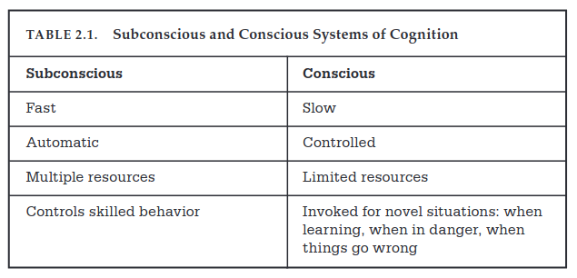
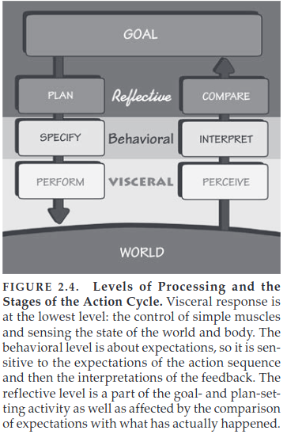

<!-- START doctoc generated TOC please keep comment here to allow auto update -->
<!-- DON'T EDIT THIS SECTION, INSTEAD RE-RUN doctoc TO UPDATE -->
**Table of Contents**  *generated with [DocToc](https://github.com/thlorenz/doctoc)*

- [Norman Chapter 2 - The Design of Everyday Things](#norman-chapter-2---the-design-of-everyday-things)
  - [Gulf of Execution and Evaluation](#gulf-of-execution-and-evaluation)
    - [Gulf of Evaluation](#gulf-of-evaluation)
  - [Seven Stages of Action](#seven-stages-of-action)
    - [Three Stages of Execution](#three-stages-of-execution)
    - [Three Stages of Evaluation](#three-stages-of-evaluation)
  - [Human Cognition and Emotion](#human-cognition-and-emotion)
    - [3 Levels of Cognition](#3-levels-of-cognition)
  - [7 Stages of Action + 3 Levels of Processing](#7-stages-of-action--3-levels-of-processing)
  - [People as storytellers](#people-as-storytellers)
  - [Learned Helplessness](#learned-helplessness)
  - [Positive Psychology](#positive-psychology)
  - [7 Stages of Action - 7 Design Principles](#7-stages-of-action---7-design-principles)

<!-- END doctoc generated TOC please keep comment here to allow auto update -->

# Norman Chapter 2 - The Design of Everyday Things

## Gulf of Execution and Evaluation

When users try to do something, they face these two gulfs **Gulf of Execution** - gap describing how
to do what the user
wants to the system (how?) and
**Gulf of Evaluation** - gap between the users actions and the effects on the system(what?).

These gulfs must be bridged by the designer.

### Gulf of Evaluation

Systems need helpful feedback loops and a good conceptual model that makes it easy for users to have
info about the
system state and is designed to match the user's thought processes.

## Seven Stages of Action

Two parts to every action - **doing** and **interpreting** the results of that doing.
Execution/Evaluation.

First stage is figuring out what our goals are...

### Three Stages of Execution

1. Plan
2. Specify
3. Perform

### Three Stages of Evaluation

1. Perceive what happened in the world
2. Trying to interpret it
3. Comparison with intended outcome

1. Goal - form the goal
2. Plan the action
3. Specify an action sequence
4. Perform action sequence
5. Perceive the state of the world
6. Interpret results
7. Compare the outcome with the goal

The stages of action can begin from the top or bottom. Many of our daily tasks are opportunistic,
meaning we do not plan
ahead.

The gulfs of execution and evaluation allow opportunity for product enhancement and innovation. Need
to have
observational skills to detect the gulf.
**Root Cause Analysis** is a technique to find the root cause of a problem by continuously asking
why.

It is hard to understand human minds, so thinking about the 7 stages of action is very helpful.

Most human thoughts are subconscious, highest level consciousness is _reflective_.

**Declarative memory** allows us to subconsciously respond immediately to factual questions.

**Procedural memory** allows us to recall activities performed to do something in order to answer a
question.

Cognition and emotion cannot be separated. Cognition attempts to make sense of the world and emotion
assigns value.
Cognition provides understanding and emotion provides value judgments.

The subconscious moves fast and is good at making patterns, but can get things wrong. It is biased
towards regularity
and structure and cannot reason through a sequence of steps. It is fast, automatic, uses multiple
resources
automatically and controls skilled behavior - we just know what to do!

Conscious mind is slow and controlled with limited resources. we use it when we are in novel
situations or unskilled, in
danger.

## Human Cognition and Emotion

Cognitive and emotional processing can be thought of on three different levels of processing that
work in concert:
visceral, behavioral, and perceptual., and reflective.

### 3 Levels of Cognition

1. Visceral Level
    - The most basic level. 'Lizard Brain'. Allows us to make quick judgements, respond
      subconsciously.
    - It does not learn well. Happens through sensitization and conditioning.
    - Fast and automatic responses.
    - Responds to the immediate present and produces an affective state, unaffected by context or
      history
    - Tightly coupled to the body-fight/flight.
    - So fast that they are not emotions, but precursors to emotions.
    - For design, it is about the immediate perception. Use aesthetic sensibilities to drive
      positive visceral
      responses! Make it attractive.
2. Behavioral Level
    - Home of learned skills based on situations that match patterns. Also happens subconsciously.
      We are aware but
      unsure.
    - Happens when performing a well-learned action. Just think of a goal and we know how to act
      already.
    - For design, every action is associated with an expectation. A positive outcome results in a
      positive affective
      response. A negative outcome results in a negative affective response. The feedback loop of
      evaluation confirms or
      disproves expectations, and results in satisfaction or disappointment.
    - Behavioral states are learned. Give rise to feeling of control when results are understood,
      frustration when
      things don't go as planned. The feedback provides reassurance. Lack of feedback makes things
      unsettling. Feedback
      is critical to good design.
    - **Feedback** resolves expectations, is critical to learning and the development of skilled
      behavior.
3. Reflective Level
    - conscious cognition. Deep understanding, reasoning, and conscious decision-making.
    - Deep and slow. Occurs after events, looking back and evaluating circumstances. Can do causal
      analysis, make
      predictions. Intertwined with emotional systems.

Designers need all three levels, but **reflection** is the most important. It is conscious and is
the level of agency.
Produces memories. It is reflection that drives us to recommend a product. May be more important
than reality.

Need all three. Behavioral level is th home of interaction and expectation-based emotions.
Understanding happens from
combo of behavioral and reflective. Enjoyment requires all three.

## 7 Stages of Action + 3 Levels of Processing

Completion immersion in an activity is called **flow**. People lose track of time and become one
with their task. Proper
level of difficulty. Behavioral level creates a powerful set of emotional responses. Subconscious
expectations
established by execution side of action cycle sets up emotional states dependent upon expectations.
This impacts our
feelings. Too easy of tasks cause boredom and too difficult causes frustration. **Flow** is when
something is just
right.

## People as storytellers

People look for causes/events to form stories. resonate with our experiences. allows us to form
generalizations.

conceptual models are a form of story, an explanation. They are essential to understanding what is
happening. Faulty
models lead to frustrations.

Delayed feedback causes bad models. Should let the user know and provide the longest possible time
to respond. When
there is delayed feedback, people use their own conceptual model of the world to determine the
perceived causal
relationship. It doesn't matter if the relationship actually exists.

## Learned Helplessness

People experience repeated failure and decide they are helpless to complete the task - they stop
trying. People blame
themselves.

## Positive Psychology

To fail is to learn. Replace failure with learning experiences. Designers need to fail to make new
understanding. Should
not be too safe.

For designers:

1. Designers should use failures as indicators of where they can improve the product.
2. Don't blame when people cannot use the product
3. Rather than showing errors messages, provide help and guidance
4. Make it possible to correct problems from help and guidance messages - not errors
5. Assume that people will be partially correct
6. Think positively for yourself and the people you interact with

Eliminate the term human error and instead think of it is as a collaboration. Designers should
attempt to minimize the
chance of inappropriate actions in the first place - using affordances, signifiers, good mapping,
and constraints to
guide the actions. Maximize the chance that users can discover and fix bad actions. Use good
feedback and have a simple,
clear conceptual model. People should understand what has happened, system state, and what action is
appropriate.

People are not machines and are not precise.

## 7 Stages of Action - 7 Design Principles

Checklist:

1. What do I want to accomplish?
2. What are the alternative action sequences?
3. What can I do now?
4. How do I do it?
5. What happened?
6. What does it mean?
7. Is it okay? Have I accomplished my goal?

**Feedforward** and **Feedback**:

* Feedforward - Information that answers questions of execution. What are the alternatives? What can
  I do? How do I do
  it?
* Feedback - Aids in understanding what has happened. Is this okay? What does it mean? What
  happened?

Build feedforward through use of signifiers, constraints, mapping. Make a good conceptual model.

Both feedback & feedforward need presented in a way that is readily interpreted by users of the
system.

7 principles of design:

1. Discoverability - it is possible to determine what actions are possible and the current state of
   the device.
2. Feedback - full and continuous information about the results of actions and the current state of
   hte product is
   available and understandable.
3. Conceptual model - design projects all info needed for a good conceptual model of the system,
   creates a feeling of
   control. conceptual model should enhance discoverability and evaluation of results.
4. Affordance - proper affordances exist to make actions possible
5. Signifiers - good use of signifiers ensures discoverability and that feedback is well
   communicated
6. Mappings - relationship b/w controls and actions is clear - spatial layout and temporal
   continuity.
7. Constraints - physical, logical, semantic, and cultural constraints to guide actions and
   interpretation.

Don't criticize until you can do better.
