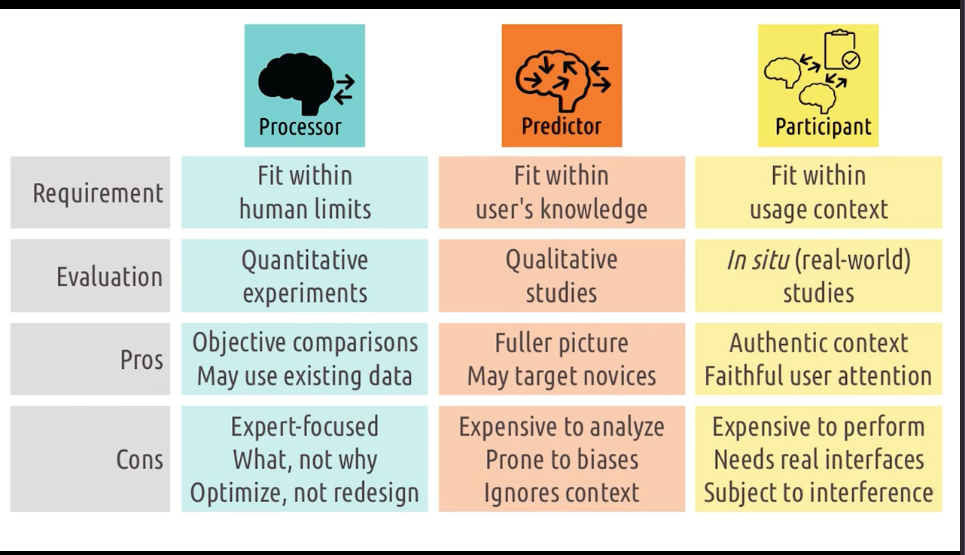

<!-- START doctoc generated TOC please keep comment here to allow auto update -->
<!-- DON'T EDIT THIS SECTION, INSTEAD RE-RUN doctoc TO UPDATE -->
**Table of Contents**  *generated with [DocToc](https://github.com/thlorenz/doctoc)*

- [2.1 Intro to Principles of Human-Centered Design](#21-intro-to-principles-of-human-centered-design)
  - [Interfaces](#interfaces)
  - [5 Tips to identify task](#5-tips-to-identify-task)
  - [Useful and Usability](#useful-and-usability)
  - [Role of User](#role-of-user)
  - [Using User models to evaluate interfaces](#using-user-models-to-evaluate-interfaces)
  - [UX](#ux)

<!-- END doctoc generated TOC please keep comment here to allow auto update -->

# 2.1 Intro to Principles of Human-Centered Design

1. Focus on Users and Tasks - not interfaces
2. Role of interface as mediator
3. user roles
4. user experience at multiple levels

## Interfaces

User and task interact through the interface.
Need to understand user goals and the task! Must understand the task.
Focusing on the task allows us to come up with revolutionary designs.

## 5 Tips to identify task

1. watch real users - don't speculate
2. talk to real users! talk aloud?
3. start small - look at small interactions. don't come in thinking you already know.
4. abstract up - keep asking why and go up the chain
5. you aren't the user. even if you do the task, you are not the person you are designing for. leave
   behind your own experiences and preconceived notions

## Useful and Usability

The ultimate goal of HCI is to create interfaces that are both useful and usable.
Useful is just allowing the user to complete tasks.
Usability closes the gap/gulf between the user and the system, reduces cognitive load.

## Role of User

1. Processor - nothing more than sensory processor. take input in and spit out output.
    1. interface should fit within human limits - what they can sense and what they can do.
    2. usability here means that it should be physically usable. user can see colors, touch buttons,
       etc.
    3. evaluate interface with quantitative experiments - see how quickly
    4. **not helpful for hci**
2. Predictor - care deeply about human knowledge, expectations, experience, thought process. they
   can predict what will happen. map input to output. get into their head.
    1. interface should fit within human knowledge, leverage what humans know, and help them learn
       what they don't know
    2. evaluate using qualitative - ex situ studies - controlled environment - do task analysis or
       cognitive walkthrough to understand thoughts.
    3. advantages over just processor view, but still just focuses on one user and one task. narrow.
3. Participant - not just interested in what is going on inside head, but around them as well. what
   other tasks, interfaces, people they are interacting with. need to understand available cognitive
   resources, competing tasks, etc.
    1. interface must fit within context. not enough to be able to use and to know how to use, they
       need the interface to work within their context
    2. evaluate using in situ studies - within authentic context - vacuum is not enough.

Processor view goes back to the behaviorist view of psychology - systematic view of human behavior.
created by john b watson - "Little albert". pavlov is another example. 19th century. Observable
behaviors and outcomes, not underlying cognition. This is just looking at behaviors in design and
not caring about why.

Predictor view goes back to cognitive - perception, memory, creativity and other things going within
the mind. Kant and Descartes worked on this. started picking up in the 1950s as a foil to behaviorism.
cognitive science. care about what the user is thinking. what do they predict the outcome to be, the
right action to take? The user is the one doing the predicting. we need to understand how they
predict the interface will behave.

Participant view goes back to the functionalism/systems psychology—human behaviors within broader
systems, contexts. uniquely cares about user environment. user/interfaces are participants within
a larger cognitive system.

## Using User models to evaluate interfaces

1. Processor Model - bring them in and time them, have them do tasks to gather quantitative data.
    - Pros:
        1. use existing data perhaps
        2. enables objective comparison - using the stats.
    - Cons:
        1. no reason for differentiation - can't think of why one interface is better than another
        2. can't differentiate by expertise
        3. helps optimize, not redesign
2. Predictor Model - ask the user questions, show them prototypes, do interviews. find info about
   why users prefer different interfaces at different times.
    - Pros:
        1. more complete picture of interaction, what they are thinking about, why they did
           something
        2. can target different levels of expertise - bring in experts vs offices
    - Cons:
        1. analysis can be expensive - not as easy as analysing numbers. a lot of attention is
           required.
        2. analysis is subject to biases. we need to fight biases.
        3. ignores the broader interaction context - not authentic environment (ex situ not in situ
           here).
3. Participant Model - view interface and user within the real context. look interface, user as
   participants in broader activity.
    - Pros:
        1. evaluate in authentic context.
        2. capture authentic level of user attention - captures distractions
    - Cons:
        1. expensive to conduct - have to set up the environment to be authentic.
        2. requires real, functional interfaces - prototype won't work. they have to be designed and
           created to work in real context.
        3. subject to uncontrollable variables - cannot control environment.

in short, we will use all of them at different times. use one and then another, informed by our
previous.

## UX

UX comes from interaction between users/tasks through interfaces. always some ux happening because
of this.

UX goes beyond simple interaction. emotional, personal, experimental relationship elements are
incorporated. need to expand scope of it.

individual - age, experience, age, expectations inform view of the user. does user feel the
interface was designed for them? are they joyous about the task?
group - different experiences bring about different experiences.
society - can bubble up to societal views.

---
