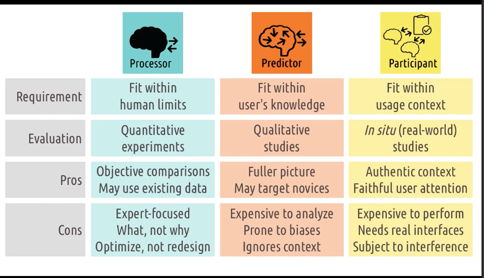
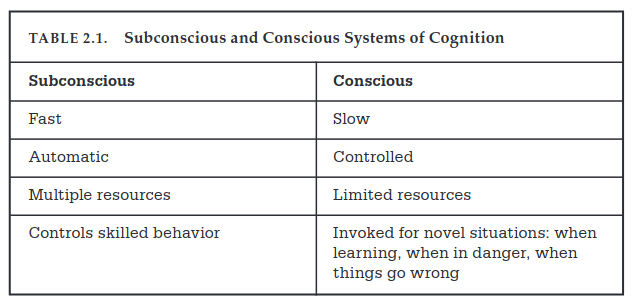
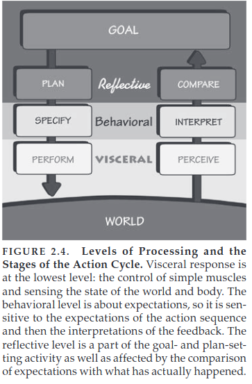

<!-- START doctoc generated TOC please keep comment here to allow auto update -->
<!-- DON'T EDIT THIS SECTION, INSTEAD RE-RUN doctoc TO UPDATE -->
**Table of Contents**  *generated with [DocToc](https://github.com/thlorenz/doctoc)*

- [HCI Section 2 Notes (Week 3)](#hci-section-2-notes-week-3)
  - [2.1 Intro to Principles of Human-Centered Design](#21-intro-to-principles-of-human-centered-design)
    - [Interfaces](#interfaces)
    - [5 Tips to identify task](#5-tips-to-identify-task)
    - [Useful and Usability](#useful-and-usability)
    - [Role of User](#role-of-user)
    - [Using User models to evaluate interfaces](#using-user-models-to-evaluate-interfaces)
    - [UX](#ux)
  - [Norman - Cognitive Engineering CH 3](#norman---cognitive-engineering-ch-3)
    - [Psychological/Physical Variables Variables](#psychologicalphysical-variables-variables)
      - [Aspects of a task](#aspects-of-a-task)
    - [Gulfs of Execution and Evaluation](#gulfs-of-execution-and-evaluation)
      - [Bridging gap of Execution:](#bridging-gap-of-execution)
      - [Bridging Gulf of Evaluation](#bridging-gulf-of-evaluation)
      - [Stages of user activities](#stages-of-user-activities)
      - [Implications of Gulf b/w Execution - Evaluation.](#implications-of-gulf-bw-execution---evaluation)
    - [Conceptual Models and System Image](#conceptual-models-and-system-image)
    - [Quality of HCI](#quality-of-hci)
    - [Power of Tools](#power-of-tools)
    - [Gulfs Revisited](#gulfs-revisited)
    - [Design Issue](#design-issue)
    - [Tradeoffs](#tradeoffs)
    - [Prescriptions](#prescriptions)
  - [2.2 Feedback Cycles](#22-feedback-cycles)
    - [Gulf of Execution](#gulf-of-execution)
    - [Gulf  of Evaluation](#gulf--of-evaluation)
    - [Norman's Bridge](#normans-bridge)
  - [Norman Chapter 2 - The Design of Everyday Things](#norman-chapter-2---the-design-of-everyday-things)
    - [Gulf of Execution and Evaluation](#gulf-of-execution-and-evaluation)
      - [Gulf of Evaluation](#gulf-of-evaluation)
    - [Seven Stages of Action](#seven-stages-of-action)
      - [Three Stages of Execution](#three-stages-of-execution)
      - [Three Stages of Evaluation](#three-stages-of-evaluation)
    - [Human Cognition and Emotion](#human-cognition-and-emotion)
      - [3 Levels of Cognition](#3-levels-of-cognition)
    - [7 Stages of Action + 3 Levels of Processing](#7-stages-of-action--3-levels-of-processing)
    - [People as storytellers](#people-as-storytellers)
    - [Learned Helplessness](#learned-helplessness)
    - [Positive Psychology](#positive-psychology)
    - [7 Stages of Action - 7 Design Principles](#7-stages-of-action---7-design-principles)

<!-- END doctoc generated TOC please keep comment here to allow auto update -->

# HCI Section 2 Notes (Week 3)

## 2.1 Intro to Principles of Human-Centered Design

1. Focus on Users and Tasks - not interfaces
2. Role of interface as mediator
3. user roles
4. user experience at multiple levels

### Interfaces

User and task interact through the interface.
Need to understand user goals and the task! Must understand the task.
Focusing on the task allows us to come up with revolutionary designs.

### 5 Tips to identify task

1. watch real users - don't speculate
2. talk to real users! talk aloud?
3. start small - look at small interactions. don't come in thinking you already know.
4. abstract up - keep asking why and go up the chain
5. you aren't the user. even if you do the task, you are not the person you are designing for. leave
   behind your own experiences and preconceived notions

### Useful and Usability

The ultimate goal of HCI is to create interfaces that are both useful and usable.
Useful is just allowing the user to complete tasks.
Usability closes the gap/gulf between the user and the system, reduces cognitive load.

### Role of User

1. Processor - nothing more than sensory processor. take input in and spit out output.
    1. interface should fit within human limits - what they can sense and what they can do.
    2. usability here means that it should be physically usable. user can see colors, touch buttons,
       etc.
    3. evaluate interface with quantitative experiments - see how quickly
    4. **not helpful for hci**
2. Predictor - care deeply about human knowledge, expectations, experience, thought process. they
   can predict what will happen. map input to output. get into their head.
    1. interface should fit within human knowledge, leverage what humans know, and help them learn
       what they don't know
    2. evaluate using qualitative - ex situ studies - controlled environment - do task analysis or
       cognitive walkthrough to understand thoughts.
    3. advantages over just processor view, but still just focuses on one user and one task. narrow.
3. Participant - not just interested in what is going on inside head, but around them as well. what
   other tasks, interfaces, people they are interacting with. need to understand available cognitive
   resources, competing tasks, etc.
    1. interface must fit within context. not enough to be able to use and to know how to use, they
       need the interface to work within their context
    2. evaluate using in situ studies - within authentic context - vacuum is not enough.

Processor view goes back to the behaviorist view of psychology - systematic view of human behavior.
created by john b watson - "Little albert". pavlov is another example. 19th century. Observable
behaviors and outcomes, not underlying cognition. This is just looking at behaviors in design and
not caring about why.

Predictor view goes back to cognitive - perception, memory, creativity and other things going within
mind. Kant and Descartes worked on this. started picking up in the 1950s as foil to behaviorism.
cognitive science. care about what the user is thinking. what do they predict the outcome to be, the
right action to take? The user is the one doing the predicting. we need to understand how they
predict the interface will behave.

Participant view goes back to the functionalism/systems psychology - human behaviors within broader
systems, contexts. uniquely cares about user environment. user/interfaces are participants within
larger cognitive system.

### Using User models to evaluate interfaces

1. Processor Model - bring them in and time them, have them do tasks to gather quantitative data.
    - Pros:
        1. use existing data perhaps
        2. enables objective comparison - using the stats.
    - Cons:
        1. no reason for differentiation - can't think of why one interface is better than another
        2. can't differentiate by expertise
        3. helps optimize, not redesign
2. Predictor Model - ask the user questions, show them prototypes, do interviews. find info about
   why users prefer different interfaces at different times.
    - Pros:
        1. more complete picture of interaction, what they are thinking about, why they did
           something
        2. can target different levels of expertise - bring in experts vs offices
    - Cons:
        1. analysis can be expensive - not as easy as analysing numbers. a lot of attention is
           required.
        2. analysis is subject to biases. we need to fight biases.
        3. ignores the broader interaction context - not authentic environment (ex situ not in situ
           here).
3. Participant Model - view interface and user within the real context. look interface, user as
   participants in broader activity.
    - Pros:
        1. evaluate in authentic context.
        2. capture authentic level of user attention - captures distractions
    - Cons:
        1. expensive to conduct - have to set up the environment to be authentic.
        2. requires real, functional interfaces - prototype won't work. they have to be designed and
           created to work in real context.
        3. subject to uncontrollable variables - cannot control environment.

in short, we will use all of them at different times. use one and then another, informed by our
previous.

### UX

UX comes from interaction between users/tasks through interfaces. always some ux happening because
of this.

UX goes beyond simple interaction. emotional, personal, experimental relationship elements are
incorporated. need to expand scope of it.

individual - age, experience, age, expectations inform view of the user. does user feel the
interface was designed for them? are they joyous about the task?
group - different experiences bring about different experiences.
society - can bubble up to societal views.

---

## Norman - Cognitive Engineering CH 3

**Cognitive Engineering** attempts to apply cognitive science to computers. Understand principles
behind human action relevant for engineering design, and to devise systems that are pleasant to use.
_Pleasurable Engagement_ is the goal.

To make tasks successful, we want to make sure we have the correct conceptual

### Psychological/Physical Variables Variables

Good design, that is pleasing, requires us to make sure we are providing control over variables of
psychological interest!

#### Aspects of a task

1. Matching psychological variables of interest to the physical variables that are being controlled.
2. Mapping relationships between physical mechanisms and system state - interaction between two
   controls should be easy - we should be able to map b/w control and function, control and outcome
3. Feedback - feedback should be immediate, not slow
4. Conceptual Model - need a solid and robust, clear, conceptual model.
5. Goals, intentions - goal is the state that the person wants to achieve and the intention is the
   decision to act to achieve that goal.
6. specifications of the action sequence - the psychological process of determining the
   psychological representation of the actions that are to be executed by the user.
7. Physical state of system - determined by the values of all physical variables.
8. Control mechanisms - physical devices that control physical variables.
9. Interpretation of system state
10. Evaluating the outcome.

### Gulfs of Execution and Evaluation

Issues arise because of the difficulty translating the psychological desires and needs of the user
into the physical tasks they will take using the controls to get to their desired system state. user
creates plans, action sequences, and interpretations that move the description of goals and
intentions closer to that required by the physical system.

#### Bridging gap of Execution:

1. Intention - start thinking about making an action -
2. Determine an action sequence - match internal specification to the external. Translate
   psychological goals of intention into the changes that need made to the physical variables under
   control of the system and follow the mapping between psychological intentions and physical
   actions permitted on the system, as well as the mapping between physical mechanisms and the
   resulting physical state variables, and psychological goals/intentions to physical state of the
   system.
3. Executing Action - first physical action in sequence - do the stuff!
4. Making contact with input mechanisms of the interface and doing the stuff you want.

#### Bridging Gulf of Evaluation

Evaluation requires comparing the interpretation of system state with original goals/intentions.
Determine what the state is.
Use:

1. the displays of interface
2. perceptual processing of displays
3. interpret displays
4. evaluate and compare the system state with goals/intentions.

#### Stages of user activities

1. Establish Goal
2. Form Intention
3. Specify Action Sequence
4. Execute Action
5. Perceiving System State
6. Interpret System State
7. Evaluate System State with respect to Goals and Intentions.

#### Implications of Gulf b/w Execution - Evaluation.

Because of gulfs, we need to try to move the system closer to the user or user closer to the system.

To do so, we want to try to make things easier to understand, provide visual clues, or language
clues to let people know. System designer should help to understand the system. need coherent design
model and system image.

### Conceptual Models and System Image

Conceptual model provides scaffolding's to build bridges across gaps in execution and evaluation.
Essential for learning and troubleshooting. Allow user to derive possible courses of actions and
responses. Needs to be designed and consistent - so that the user can develop a mental model of the
system.

1. Design Model - Conceptual model held by designer
    - model of system to be built-based on user task, requirements, capabilities.
    - needs to consider user background, experience, limits
2. User Model - conceptual model held by the user
    - user mental model that results from user interpretation of system image.
    - designer should want the user's model to be compatible with the design model.
    - Through interaction with the system image, the design model and user model can be in sync.
3. System Image - image resulting from physical structure that has been built
    - the more consistent, well-designed it is, the smaller the gap b/w design and user model.
    - easier to make a good one for specific, complicated tasks (like addition, subtraction)

### Quality of HCI

Pleasurable programs should be the goal... should be fun to use.

systems need to provide strong sense of understanding and control. they should reveal their
underlying conceptual model, emphasize comfort, ease, and pleasure. _convivial fools_.

Computer should be invisible to the user and not intrude upon user.

### Power of Tools

Systems should be viewed as tools, when they are good!

- smalltalk
- xerox star
- unix
  -spreadsheets
  -steamer - steam generator system for large ships that uses intelligent graphics to help

need a balance between super intelligent and super simple tools! _conviviality_, make visible
operations and assumptions of tools. Make sure we also give the user a good image of what is going
on.

### Gulfs Revisited

Most of the pleasurableness from a good system results from the direct relationship b/w
psychological and physical variables - a good bridging.

- need:
    - clear mapping from psychological variables in which goals are stated to physical variables
      upon which controls are exerted
    - mapping of physical variables of the system to psychological variables.

more direct mapping = better systems.

**Levels?** How much is the proper level.

### Design Issue

Design is so hard because of number of variables/potential actions is huge, and the tech is limited.

We want to create **USER-CENTERED INTERFACE**.

APPROXIMATE models are okay (Short term memory used as example)

### Tradeoffs

We are always going to have to make compromises and tradeoffs in our design. look at design as a
whole, not isolated people!

Info vs Time: more info available slows down the system, increases time to do tasks.

To make good designs, make sure that you focus on the user model, design model, and the system
image. These are **FIRST ORDER ISSUES** .

VisiCalc is one of the best examples... commands were a second order issue - the design was primary!
helped by the fact it was **self-contained* and the user was a frequent user!

### Prescriptions

1. Create a science of user centered design - we want principles that can be applied at the time of
   the design. get design to a pretty good state the first time around. need principles and tools

2. take interface design seriously - need knowledge of design/programming/tech, knowledge of the
   people/psych/communication, and knowledge of the task that is going to be accomplished.

3. separate the design of the interface from design of system - modularize. they should be
   separated.

4. DO UCD! start with user needs

---

## 2.2 Feedback Cycles

Ubiquitous, they are everywhere. Feedback cycles are how we learn everything. Do something, see
result, and then adjust what we do accordingly.

do something, learn from the experience - adaptive behavior. getting better over time!

all of hci is an application of feedback cycles - person and task, person and interface, systems of
multiple people and interfaces.

### Gulf of Execution

How do I know what I can do? How to figure out what actions to take to make the state of the system match their goal state? How hard is it to do in the interface?
1. Identity intentions - what is the goal in the context of the system?
2. Identify actions to accomplish goals.
3. Execute the actions within the interface.

To bridge, maybe the interface should help us re-frame our questions.

5 tips:
1. Make functions discoverable. It should be clear what a user can do.
2. Let the user mess around - let them feel safe, avoid buttons that cause harm.
3. Be consistent with other tools - use standards that other tools use.
4. Know your user - for novices, identifying intentions and actions is most important. for experts, actually doing the action is more valuable, care about efficiency.
5. feedforward - feedback on what the user might want to do. help them predict what will happen as a result of their action.

### Gulf  of Evaluation
Express through the interface the result of the actions that the user took. 
1. Physical form of output - visual, sound, some kind of output.
2. Interpretation  of the output for the real meaning of the feedback.
3. Evaluation of the interpretation to figure out if goals were accomplished.

5 tips:
1. give constant feedback - do not wait for feedback. show them right away. help them understand where the system is in executing.
2. give feedback immediately - even if it is not a full response. let the user know their input is recognized.
3. match feedback to the action. subtle actions should have subtle feedback.
4. vary feedback. sometimes can do it on the screen, other times can do sounds or haptic feedback.
5. leverage direct manipulation - let the user feel that they are directly manipulating.

### Norman's Bridge

Norman proposes considering Gulfs as bridges because this is how the gulf is bridged.
1. Bridge of Execution - make the world match goal
   - Plan
   - Specify
   - Perform
2. Bridge of Evaluation - check that the system state matches the goal
    - Perceive
    - Interpret
    - Compare

7 Questions:
1. How easily can one determine the function of the device? (goal) What do i want to do?
2. How easily can one determine what actions are possible? (planning) What are the alternatives?
3. How easily can one determine the mapping from intent to movement? (specify) What can  i do to actually perform?
4.  How easily can one actually perform the physical actions? (perform) How do i do that?
5. How easily can the user tell what state the system is in? (perceive) What happened?
6. How easily can they tell if the system is in the desired state? (interpret) What does that mean?
7. How easily can the user determine the mapping from state to interpretation? (compare) Is that okay?

Phases:
1. Visceral - Perform and perceiving - Reaction
2. Behavioral - Specifying and interpreting - Deliberation
3. Reflective - plan and compare - Metacognition

---

## Norman Chapter 2 - The Design of Everyday Things

### Gulf of Execution and Evaluation

When users try to do something, they face these two gulfs **Gulf of Execution** - gap describing how
to do what the user
wants to the system (how?) and
**Gulf of Evaluation** - gap between the users actions and the effects on the system(what?).

These gulfs must be bridged by the designer.

#### Gulf of Evaluation

Systems need helpful feedback loops and a good conceptual model that makes it easy for users to have
info about the
system state and is designed to match the user's thought processes.

### Seven Stages of Action

Two parts to every action - **doing** and **interpreting** the results of that doing.
Execution/Evaluation.

First stage is figuring out what our goals are...

#### Three Stages of Execution

1. Plan
2. Specify
3. Perform

#### Three Stages of Evaluation

1. Perceive what happened in the world
2. Trying to interpret it
3. Comparison with intended outcome

1. Goal - form the goal
2. Plan the action
3. Specify an action sequence
4. Perform action sequence
5. Perceive the state of the world
6. Interpret results
7. Compare the outcome with the goal

The stages of action can begin from the top or bottom. Many of our daily tasks are opportunistic,
meaning we do not plan
ahead.

The gulfs of execution and evaluation allow opportunity for product enhancement and innovation. Need
to have
observational skills to detect the gulf.
**Root Cause Analysis** is a technique to find the root cause of a problem by continuously asking
why.

It is hard to understand human minds, so thinking about the 7 stages of action is very helpful.

Most human thoughts are subconscious, highest level consciousness is _reflective_.

**Declarative memory** allows us to subconsciously respond immediately to factual questions.

**Procedural memory** allows us to recall activities performed to do something in order to answer a
question.

Cognition and emotion cannot be separated. Cognition attempts to make sense of the world and emotion
assigns value.
Cognition provides understanding and emotion provides value judgments.

The subconscious moves fast and is good at making patterns, but can get things wrong. It is biased
towards regularity
and structure and cannot reason through a sequence of steps. It is fast, automatic, uses multiple
resources
automatically and controls skilled behavior - we just know what to do!

Conscious mind is slow and controlled with limited resources. we use it when we are in novel
situations or unskilled, in
danger.

### Human Cognition and Emotion

Cognitive and emotional processing can be thought of on three different levels of processing that
work in concert:
visceral, behavioral, and perceptual., and reflective.

#### 3 Levels of Cognition

1. Visceral Level
    - The most basic level. 'Lizard Brain'. Allows us to make quick judgements, respond
      subconsciously.
    - It does not learn well. Happens through sensitization and conditioning.
    - Fast and automatic responses.
    - Responds to the immediate present and produces an affective state, unaffected by context or
      history
    - Tightly coupled to the body-fight/flight.
    - So fast that they are not emotions, but precursors to emotions.
    - For design, it is about the immediate perception. Use aesthetic sensibilities to drive
      positive visceral
      responses! Make it attractive.
2. Behavioral Level
    - Home of learned skills based on situations that match patterns. Also happens subconsciously.
      We are aware but
      unsure.
    - Happens when performing a well-learned action. Just think of a goal and we know how to act
      already.
    - For design, every action is associated with an expectation. A positive outcome results in a
      positive affective
      response. A negative outcome results in a negative affective response. The feedback loop of
      evaluation confirms or
      disproves expectations, and results in satisfaction or disappointment.
    - Behavioral states are learned. Give rise to feeling of control when results are understood,
      frustration when
      things don't go as planned. The feedback provides reassurance. Lack of feedback makes things
      unsettling. Feedback
      is critical to good design.
    - **Feedback** resolves expectations, is critical to learning and the development of skilled
      behavior.
3. Reflective Level
    - conscious cognition. Deep understanding, reasoning, and conscious decision-making.
    - Deep and slow. Occurs after events, looking back and evaluating circumstances. Can do causal
      analysis, make
      predictions. Intertwined with emotional systems.

Designers need all three levels, but **reflection** is the most important. It is conscious and is
the level of agency.
Produces memories. It is reflection that drives us to recommend a product. May be more important
than reality.

Need all three. Behavioral level is th home of interaction and expectation-based emotions.
Understanding happens from
combo of behavioral and reflective. Enjoyment requires all three.

### 7 Stages of Action + 3 Levels of Processing

Completion immersion in an activity is called **flow**. People lose track of time and become one
with their task. Proper
level of difficulty. Behavioral level creates a powerful set of emotional responses. Subconscious
expectations
established by execution side of action cycle sets up emotional states dependent upon expectations.
This impacts our
feelings. Too easy of tasks cause boredom and too difficult causes frustration. **Flow** is when
something is just
right.

### People as storytellers

People look for causes/events to form stories. resonate with our experiences. allows us to form
generalizations.

conceptual models are a form of story, an explanation. They are essential to understanding what is
happening. Faulty
models lead to frustrations.

Delayed feedback causes bad models. Should let the user know and provide the longest possible time
to respond. When
there is delayed feedback, people use their own conceptual model of the world to determine the
perceived causal
relationship. It doesn't matter if the relationship actually exists.

### Learned Helplessness

People experience repeated failure and decide they are helpless to complete the task - they stop
trying. People blame
themselves.

### Positive Psychology

To fail is to learn. Replace failure with learning experiences. Designers need to fail to make new
understanding. Should
not be too safe.

For designers:

1. Designers should use failures as indicators of where they can improve the product.
2. Don't blame when people cannot use the product
3. Rather than showing errors messages, provide help and guidance
4. Make it possible to correct problems from help and guidance messages - not errors
5. Assume that people will be partially correct
6. Think positively for yourself and the people you interact with

Eliminate the term human error and instead think of it is as a collaboration. Designers should
attempt to minimize the
chance of inappropriate actions in the first place - using affordances, signifiers, good mapping,
and constraints to
guide the actions. Maximize the chance that users can discover and fix bad actions. Use good
feedback and have a simple,
clear conceptual model. People should understand what has happened, system state, and what action is
appropriate.

People are not machines and are not precise.

### 7 Stages of Action - 7 Design Principles

Checklist:

1. What do I want to accomplish?
2. What are the alternative action sequences?
3. What can I do now?
4. How do I do it?
5. What happened?
6. What does it mean?
7. Is it okay? Have I accomplished my goal?

**Feedforward** and **Feedback**:

* Feedforward - Information that answers questions of execution. What are the alternatives? What can
  I do? How do I do
  it?
* Feedback - Aids in understanding what has happened. Is this okay? What does it mean? What
  happened?

Build feedforward through use of signifiers, constraints, mapping. Make a good conceptual model.

Both feedback & feedforward need presented in a way that is readily interpreted by users of the
system.

7 principles of design:

1. Discoverability - it is possible to determine what actions are possible and the current state of
   the device.
2. Feedback - full and continuous information about the results of actions and the current state of
   hte product is
   available and understandable.
3. Conceptual model - design projects all info needed for a good conceptual model of the system,
   creates a feeling of
   control. conceptual model should enhance discoverability and evaluation of results.
4. Affordance - proper affordances exist to make actions possible
5. Signifiers - good use of signifiers ensures discoverability and that feedback is well
   communicated
6. Mappings - relationship b/w controls and actions is clear - spatial layout and temporal
   continuity.
7. Constraints - physical, logical, semantic, and cultural constraints to guide actions and
   interpretation.

Don't criticize until you can do better.
