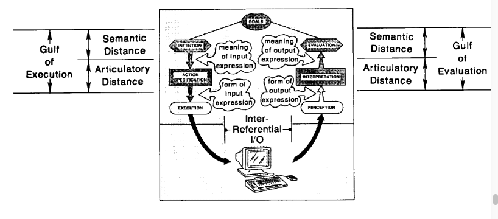

<!-- START doctoc generated TOC please keep comment here to allow auto update -->
<!-- DON'T EDIT THIS SECTION, INSTEAD RE-RUN doctoc TO UPDATE -->
**Table of Contents**  *generated with [DocToc](https://github.com/thlorenz/doctoc)*

- [Direct Manipulation Interfaces](#direct-manipulation-interfaces)
    - [Shneiderman's principles of direct manipulation](#shneidermans-principles-of-direct-manipulation)
    - [Two Aspects of Directness : Distance and Engagement](#two-aspects-of-directness--distance-and-engagement)
        - [Distance](#distance)
        - [Direct Engagement](#direct-engagement)
    - [Two forms of distance : Semantic and Articulatory](#two-forms-of-distance--semantic-and-articulatory)
        - [Semantic Distance](#semantic-distance)
            - [Semantic Distance - Gulf of Execution](#semantic-distance---gulf-of-execution)
            - [Semantic Distance - Gulf of Evaluation](#semantic-distance---gulf-of-evaluation)
            - [Reducing Semantic Distance](#reducing-semantic-distance)
                - [Changing System to Reduce Semantic Distance](#changing-system-to-reduce-semantic-distance)
                - [Changing User to Reduce Semantic Distance](#changing-user-to-reduce-semantic-distance)
        - [Articulatory Distance](#articulatory-distance)
    - [Direct Engagement](#direct-engagement-1)
    - [Problems with direct manipulation](#problems-with-direct-manipulation)

<!-- END doctoc generated TOC please keep comment here to allow auto update -->

# Direct Manipulation Interfaces

Direct manipulation is good interface design.

1. Reduced distance between user intentions and facilities provided by the machine. Goals are
   effortless to accomplish.
2. System representations of objects behave as if they are the objects themselves.

## Shneiderman's principles of direct manipulation

3 Properties of direct manipulation:

1. Continuous representation of the object of interest.
2. Physical actions/labeled button presses.
3. Rapid incremental and reversible operations - immediate feedback.

6 Virtues of direct manipulation:

1. Novices can learn quickly
2. Experts can work fast.
3. Knowledgeable users can retain concepts
4. Error messages are not needed.
5. Users can immediately get feedback to see if they are furthering their goals or change the
   direction.
6. User anxiety is reduced because system is comprehensible and actions are reversible.

## Two Aspects of Directness : Distance and Engagement

Two distinct aspects of directness:

1. **Distance** - Short distance b/w thoughts and physical requirements of the system under use
2. **Engagement** - Qualitative feeling of engagement - direct manipulation of the object of
   interest.
    - language metaphor: interface is a language medium for the user and system to have a
      conversation
    - model-world metaphor: interface is world where user can act and changes state in response to
      user actions. no
      intermediary b/w user and the world. users act directly on the task domain themselves.

### Distance

Directness is not a property of the interface alone - involves relationship b/w task and the way it
can be accomplished
in the interface.

We want minimal effort to bridge the gulf of execution.

**Gap of Execution** - Commands of system should match thoughts and goals of the user.

**Gap of Evaluation** - output displays good conceptual model that is readily perceived,
interpreted, evaluated.

More direct, less cognitive effort.

### Direct Engagement

Directly engaged with the control of the objects themselves - not the program.

Need __Naive realism__ where we forget about the interface and act like we are really just
interacting with the objects
themselves.

## Two forms of distance : Semantic and Articulatory

Inputs and outputs to systems often speak and use two different languages - which causes confusion.

### Semantic Distance

**Semantic distance** is the relation of the meaning of an expression in the interface to what the
user wants to say.

1. Is it possible to say what one wants to say within the interface?
2. Can things of interest be said concisely?

#### Semantic Distance - Gulf of Execution

Turing tar pits are simple systems where the relationship between user intention and organization of
instructions is
distant and hard to follow.
For semantic directness, match interface language to the way that the person thinks of the task. The
more the user has
to provide, the greater the distance.

#### Semantic Distance - Gulf of Evaluation

Amount of processing structure required for user to determine if goals have been achieved.

#### Reducing Semantic Distance

Requires work by system or by the user to bridge the gaps.

##### Changing System to Reduce Semantic Distance

1. Designer can use higher level languages to match the user. (input)
    - requires consistency across interface surface.
    - makes takes easier to specify but is too specific.
    - need primitive operations carefully selected. conflict between generality and mapping to
      specific problem domains.
    - as language increases, the functions become more complex and specialized. focus more on
      language and knowing it
      than the domain of action.
2. (output)
    - WYSIWYG, spreadsheets, etc.
    - balance between being too specific and too rich.
    - loss of generality.

Expert users can reduce the gaps and become more direct, but this automated sense does not make it a
good interface.

##### Changing User to Reduce Semantic Distance

New model for users. Move users closer to the systems.

Designers should provide users with good representation of the task domain in question.

Every interface language implies a relationship between user and system and task.

Need to really understand the task that is being performed to reduce semantic distance.

### Articulatory Distance

Relationship between meanings of expressions and the physical form.

This is where we have things like drawing with a stylus like a piece of paper.

On the input side, provide an interface that permits specification of an action by mimicking it.

Need relationship between the form of an item and its meaning.

Dependent on I/O technology.

## Direct Engagement

Happens when user experiences direct involvement, no intermediary.

Need:

1. Execution and evaluation both semantically and articulately direct.
2. Input/output should be inter-referential, make use of one another.
3. Should be responsive, no delays.
4. Unobtrusive interface

Need rapid feedback and continuous representation of system state.

## Problems with direct manipulation

Not good for repetitive tasks. Can have difficulty being accurate or handling variables.

Might miss out onb some of the new things and innovations.
