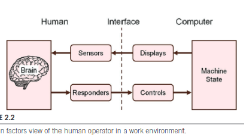

# Mackenzie Ch2

## Time Scale of Human Action

Newell's 4 band - each with 3 levels within:

1. Biological Band
2. Cognitive Band - research on selection techniques, menu design, feedback, text entry. time from 200ms - 24s
3. Rational Band - tasks span minutes or hours. web navigation, user search, ucd, collaborative computing, etc.
4. Social Band - days/weeks/months. workplace habits, groupware usage, social networking, online dating, user style and
   preferences.
5. Historical band - years - thousands of years.
6. Evolutionary band - 10000s to millions of years.

Most common dependent variable in experimental research is time, time it takes to do a task.

HCI Research is high level and low level. At the low level, it is quantitative.At the high level (social), it is
qualitative. At the social level, researchers use interviews, observation, case studies, etc.

## Human Factors

Processor model (i/o) vs human factor model (human as a machine).

In human factor model, human monitors state of computer through sensors and displays and controls the state of computer through responders and controls.

## Sensors
