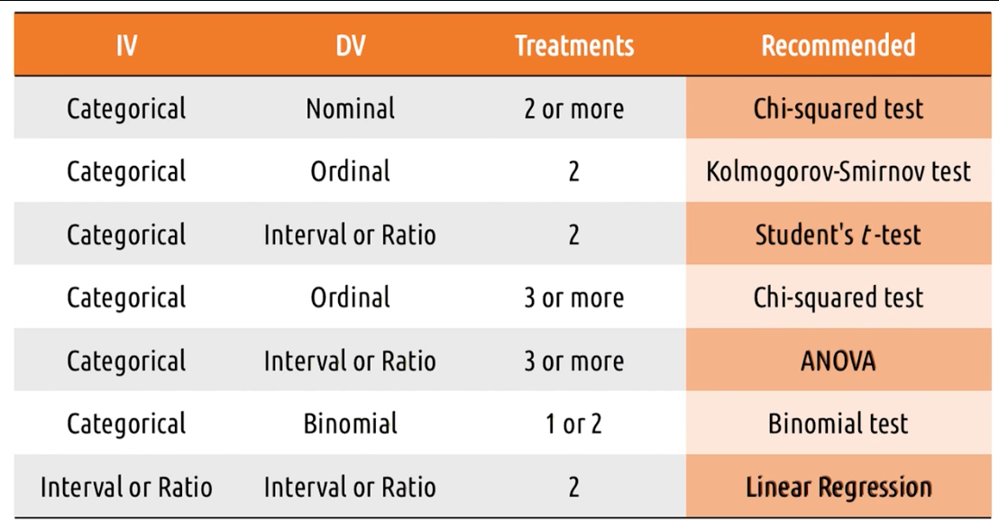

### Quantitative Data and Empirical Tests

The Kind of hypothesis test we use depends on whether we have nominal, ordinal, interval or ratio
data.

For:

1. Nominal data - Chi-squared or fisher's exact test, g-test
2. Ordinal - Kolmogorov-Smirnov test or chi-squared or median test
3. Interval/Ratio - Student's t-test, MWW Test, or Kruskal-Wallis test

#### Chi-squared Test

Check if distribution of values across a number of buckets is comparable for two alternatives

Chi-squared is not good for ranking. assumed categories are independent.
so for ordinal, use Kolmogorov-smirnov

#### Kolmogorov-Smirnov test

Used for ordinal data - like chi-squared but sensitive to rankings

#### Median test

Used for ordinal data - test if the medians of two categories are different.

#### Student's t-test

Take category, look at averages.
distance has to be big enough to justify, and depends on standard deviation.

use when data is normally distributed or else use Mann-Whitney Wilcox Test or Kruskal-Wallis

### Special Statistical tests

Chi-squared is most common, but if we want to test 3 or more different treatments, we will want
special methods:

Repeated testing raises the likelihood of error because repeating the same experiment over and over:

1. Type 1 Error - false positive
2. Type 2 Error - false negative

Normal and OOrdinal, use chi-squared, fisher's exact test, or g-test. chi-squared won't tell us
where the different is, just that there is a difference.
Combine chi-squared with pair-wise (repeated) testing.

For interval and ratio, use ANOVA (Analysis of Variance) - test between all three at the same time.
can have two dimensions of independent variables. won't tell us where the differences are, so need
to do pairwise t-tests.

If we want our independent variable to be a ratio, we need linear or logistic regression.

Binomial data - if we have success/failure data, it's binary. data looks continuous, but isn't.
need two-sample or one-sample binomial test.

### 5 tips for empirical evaluations

1. Control what you can, document what you can't. make them identical
2. Limit your variables. more variables, more noise
3. Work backwards - figure out what you want to answer, then decide analysis, then the data.
4. Script analyses in advance
5. pay attention to power (size of difference that can be detected) - need more participants if you
   want a smaller difference

## Predictive Evaluation

Use appropriately. Don't replace qualitative or empirical, but can use to fill in gaps when we would
otherwise do nothing.

### Types of Predictive Evaluation

1. Heuristic evaluation - have evaluators investigate the interface and have them generate a report.
   gives us small snapshots about what people think when using the interface.
2. model based evaluation - take models and trace through it in the context of our designed
   interface.
3. simulation based evaluation - ai agent to interact like a human

### Cognitive Walkthrough

Mentally simulating what user sees and thinks, does while walking through interface. try to imagine
self as novice user.

Evaluate against the gulfs of execution and evaluation. have to really put yourself in the user's
shoes.

## Evaluating Prototypes

Apply multiple evaluation techniques of prototypes to constantly center around the user. Understand
how the user relates to the design at every iteration of the lifecycle.

### Methods

Predictive: Does not require users, informs ongoing design decisions, investigates participant's
thought process
Qualitative: Informs ongoing design decisions, investigates participant's thought process, actual
participants
Empirical: Identifies provable advantages, generalizable conclusions, actual participants

