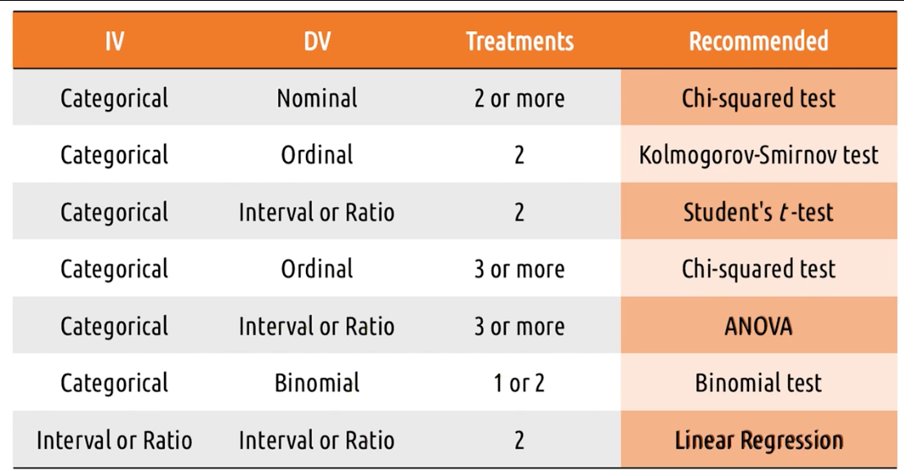

# 3.6 Evaluation

Take what we have designed and get user feedback.

Methods for evaluation:

- Early: Qualitative
- Later: Does it help their workflow?
- Last: Empirical, quantitative evaluation
- Predictive evaluation

## Three types of Evaluation strategies

1. Qualitative Evaluation — What do users like, dislike, what's easy?
2. Empirical Evaluation-Controlled experiments evaluated quantitatively with many users.
3. Predictive Evaluation — Evaluation without users. Faster than having to deal with users.

## Evaluation Terminology

- Reliability—whether a measure is consistent over time. We want high reliability
- Validity—How accurately an evaluation measures reality.
- Generalizable-The extent to which we can apply our lessons learned to broader people.
- Precision-How specific the assessment is?

## Five Tips: What to Evaluate

1. Efficiency—how long does it take for users to complete certain tasks?
2. Accuracy-how many errors do users make?
3. Learnability-how long does it take a novice user to attain expertise?
4. Memorability — how well does a user remember about the interface after a break?
5. Satisfaction - avoid social desirability.

Articulate what data you're gathering, why, and what methods you will use.

## Evaluation Timeline

Over time, the methods we use when evaluating will change.

In the beginning, they are formative. Intention is to improve the interface going forward.
More qualitative. Lab testing.

In the end, they are summative. Say concretely at the end what our result is.
More empirical, assess changes. Test in situ—in the field with more finished product.

Predictive also help generate ideas and inform changes that should happen over-time.

## Evaluation Design

To ensure that our evaluation is successful:

1. Define the task-context, constraints, tasks.
2. Define performance measures—how are we going to evaluate the user's performance? Helps avoid confirmation bias.
   Forces us to objectively analyze.
3. Develop the experiment—how are we going to gather the data? What will users do? What will be measured?
4. Recruit Participants—make sure they're aware of their rights
5. Do the experiment
6. Analyze the data—focus on what the data tells us
7. Summarize the data to inform our ongoing design process

We will make this part of our design life cycle.

## Qualitative Evaluation

What did you like/dislike/think? What was your goal?

Use methods like we used for need-finding. Interviews, thank aloud protocols, focus groups, surveys.

### Designing a Qualitative Evaluation

To design - answer these questions:

1. Prior experience or live demonstration?
2. Synchronous or asynchronous? Synchronous might be more beneficial, but asynchronous is easier to carry out.
3. One interface vs. multiple prototypes? If multiple, make sure to vary the feedback.
4. Think aloud protocol vs. post-event protocol? post-event makes you wait until the end to give feedback, but
   think-aloud might introduce new biases.
5. Individuals vs. groups? Groups can build on each other, but introduce biases. Individuals are not biased.

### Capturing a Qualitative Evaluation

1. Record session
    - Pros: Automated, Comprehensive, Passive
    - Cons: Intrusive, Non-Analyzable, Screen-Less
2. Note-taking
    - Pros: Cheap, Non-Intrusive, Analyzable
    - Cons: Slow, Manual, Limited in information captured
3. Software Logging
    - Pros: Automated, Passive, Analyzable
    - Cons: Limited, Narrow, Tech-Sensitive (need a working prototype already to test it)

### Five Tips for Qualitative Evaluations

1. Run pilot studies—try experiments with family/friends before real-users
2. Focus on feedback
3. Use questions
4. Tell users what to do, but not how to do it
5. Capture satisfaction—ask if they like it

## Empirical Evaluation

Capture something numeric and interpret. Come to something that is verifiable and conclusive.

Used within the industry to compare designs. In research, used as the basis for new theories to be built.

Involves comparisons—objectively. How can we show that there is a difference between two different designs?

### Designing Empirical Evaluation

Treatments—multiple conditions—what a participant does during the experiment. We investigate comparisons between
treatments and make conclusions about how the treatments are different.

Decide if each participant participates in one or both treatments.

**Between Subject Design—**comparison of data from one group to participants in another group.

**Within Subjects Design—**Comparison within one group experiencing multiple treatments. The first treatment will bias,
so we want to make sure that we will randomly assign them to the order of treatments. Allows us to gather even more
data. Allows us to do within subjects and between subjects. Requires more time from participants.

**Random Assignment—**using random choice to determine who gets which treatment. is required.

### Hypothesis Testing

Test whether the data allows us to confirm that the opposite is true.

Statistically significant(p-value < 0.05)

## Quantitative Data
### Quantitative Data and Empirical Tests

The Kind of hypothesis test we use depends on whether we have nominal, ordinal, interval or ratio
data.

For:

1. Nominal data - Chi-squared or fisher's exact test, g-test
2. Ordinal - Kolmogorov-Smirnov test or chi-squared or median test
3. Interval/Ratio - Student's t-test, MWW Test, or Kruskal-Wallis test

#### Chi-squared Test

Check if distribution of values across a number of buckets is comparable for two alternatives

Chi-squared is not good for ranking. assumed categories are independent.
so for ordinal, use Kolmogorov-smirnov

#### Kolmogorov-Smirnov test

Used for ordinal data - like chi-squared but sensitive to rankings

#### Median test

Used for ordinal data - test if the medians of two categories are different.

#### Student's t-test

Take category, look at averages.
distance has to be big enough to justify, and depends on standard deviation.

use when data is normally distributed or else use Mann-Whitney Wilcox Test or Kruskal-Wallis

### Special Statistical tests

Chi-squared is most common, but if we want to test 3 or more different treatments, we will want
special methods:

Repeated testing raises the likelihood of error because repeating the same experiment over and over:

1. Type 1 Error - false positive
2. Type 2 Error - false negative

Normal and OOrdinal, use chi-squared, fisher's exact test, or g-test. chi-squared won't tell us
where the different is, just that there is a difference.
Combine chi-squared with pair-wise (repeated) testing.

For interval and ratio, use ANOVA (Analysis of Variance) - test between all three at the same time.
can have two dimensions of independent variables. won't tell us where the differences are, so need
to do pairwise t-tests.

If we want our independent variable to be a ratio, we need linear or logistic regression.

Binomial data - if we have success/failure data, it's binary. data looks continuous, but isn't.
need two-sample or one-sample binomial test.

### 5 tips for empirical evaluations

1. Control what you can, document what you can't. make them identical
2. Limit your variables. more variables, more noise
3. Work backwards - figure out what you want to answer, then decide analysis, then the data.
4. Script analyses in advance
5. pay attention to power (size of difference that can be detected) - need more participants if you
   want a smaller difference

## Predictive Evaluation

Use appropriately. Don't replace qualitative or empirical, but can use to fill in gaps when we would
otherwise do nothing.

### Types of Predictive Evaluation

1. Heuristic evaluation - have evaluators investigate the interface and have them generate a report.
   gives us small snapshots about what people think when using the interface.
2. model based evaluation - take models and trace through it in the context of our designed
   interface.
3. simulation based evaluation - AI agent to interact like a human

### Cognitive Walkthrough

Mentally simulating what user sees and thinks, does while walking through interface. try to imagine
self as novice user.

Evaluate against the gulfs of execution and evaluation. have to really put yourself in the user's
shoes.

## Evaluating Prototypes

Apply multiple evaluation techniques of prototypes to constantly center around the user. Understand
how the user relates to the design at every iteration of the lifecycle.

### Methods

Predictive: Does not require users, informs ongoing design decisions, investigates participant's
thought process
Qualitative: Informs ongoing design decisions, investigates participant's thought process, actual
participants
Empirical: Identifies provable advantages, generalizable conclusions, actual participants

